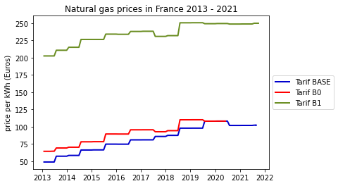

From the news: 

A series of quick charts inspired by news items: 

> Le Premier ministre a annoncé ce jeudi soir un gel des tarifs réglementés du gaz et un plafonnement à 4 % de la hausse des prix de l'électricité via une forte baisse de la 
> fiscalité. A moins de sept mois de la présidentielle, le gouvernement dévoile ce « bouclier tarifaire » pour éviter à tout prix une crise sociale du type « gilets jaunes ».

